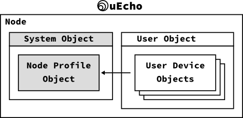
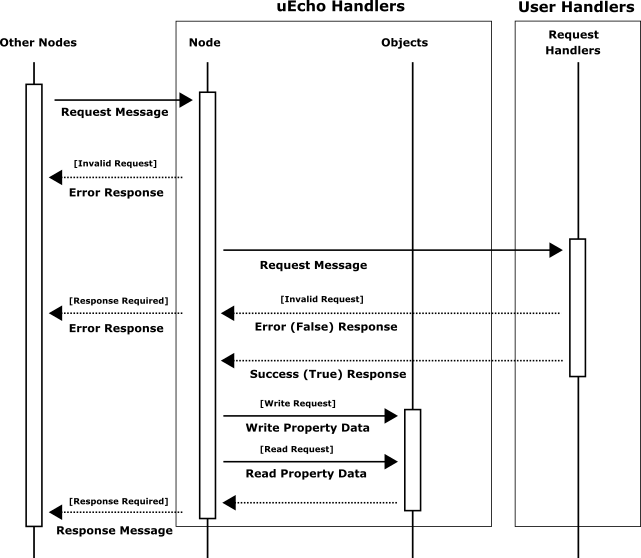

# Inside of uEcho Device

A [ECHONET Lite][enet] node includes the objects, and the objects can be classified into two types: profile objects and device objects. The profile object is standard profile information such as the operation status, manufacturer information, and device object list. The device object is a logical model of the information or of control items that can be remotely controlled. 



## Node Profile Object

The node profile object is a standard profile object, [ECHONET Lite][enet] node must have the following mandatory profile class object which has all children objects of the node [\[1\]][enet-spec].

- Class group code: 0x0E
- Class code: 0xF0
- Instance code: 0x01 (general node)

The `uecho-py` updates the node profile class objects automatically when the children objects in the node are changed, and so the developer doesn't need to update the node profile object yourself.

## Device Message Handler and Observer

The `uecho-py` handles all request messages from other nodes automatically, the developer need only control request message permissions from other nodes and controllers to the target object properties using the object property handlers of the `uecho-py`. However, the developer can set some request message observers into the node and objects to listen the raw messages of [ECHONET Lite][enet] too. The following figure shows the message handling sequence of `uecho-py`.



The request message observers of the node and object can listen all request messages, but the object property handlers receives only valid request messages.

### Property Message Handler

The `Object::set_request_handler()` can set the following permission handler to an object property to handle valid request messages from other nodes. 

```
class ObjectRequestHandler(metaclass=abc.ABCMeta):
    @abc.abstractmethod
    def property_read_requested(self, prop: Property) -> bool:
    @abc.abstractmethod
    def property_write_requested(self, prop: Property, data: bytes) -> bool:
```

The developer handles the request messages from other nodes. The developer should return a true if the request message is valid, otherwise false. In addition, the developer does not need to update the target property data by the request property data because the `uecho-py` updates the target property by the request property data automatically when the handler returns true. The following example shows to check a write request message and set the valid property data to the target property.

```
    def property_read_requested(self, prop: Property) -> bool:
        if prop.code != 0x80:
            return False
        return True

    def property_write_requested(self, prop: Property, data: bytes) -> bool:
        if prop.code != 0x80:
            return False
        if len(prop.data) != 1:
            return False
        if (data[0] != 0x30) and (data[0] != 0x31):
            return False
        return True
```

The `Object::set_request_handler()` sets the permission handlers for read and write requests.

### Node Message Listener

The `LocalNode::add_observer()` can set the following observer to get all message for the node from other nodes, thus the message might be invalid.

```
class Observer(metaclass=abc.ABCMeta):
    @abc.abstractmethod
    def message_received(self, msg: Message):
```

### Object Message Listener

The `Object::add_observer()` can set the following observer to get only valid messages for the object from other nodes.

```
class Observer(metaclass=abc.ABCMeta):
    @abc.abstractmethod
    def message_received(self, msg: Message):
```

## References

- \[1\] [Part II ECHONET Lite Communication Middleware Specification][enet-spec]
- \[2\] [Detailed Requirements for ECHONET Device objects][enet-spec]

[enet]:http://echonet.jp/english/
[enet-spec]:http://www.echonet.gr.jp/english/spec/index.htm
